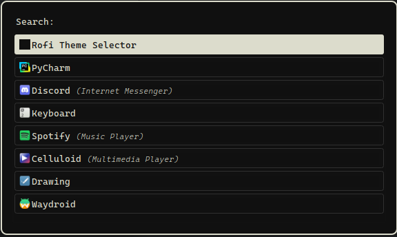

# [Rofi](https://github.com/davatorium/rofi) Darkburn Theme

### Theme based on [darkburn](https://github.com/gorauskas/darkburn-theme/) theme from Emacs

# Instalation

1. Download [darkburn.rasi](https://github.com/macyey9/rofi-darkburn-theme/blob/main/darkburn.rasi)
2. Inside /.config/config.rasi, paste ``@theme "darkburn"``